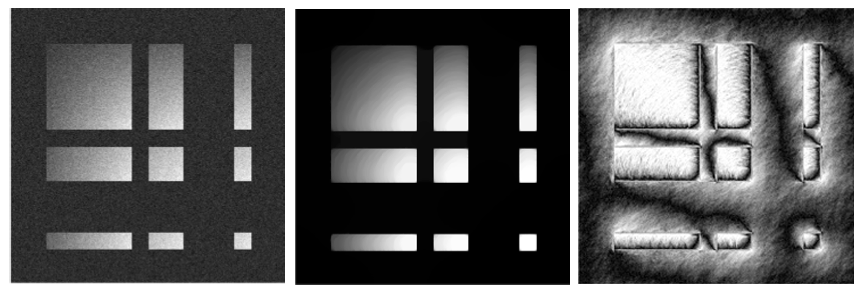
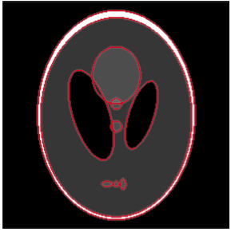

.. Math Imaging Code Library documentation master file, created by
   sphinx-quickstart on Wed Sep 13 10:39:06 2017.
   You can adapt this file completely to your liking, but it should at least
   contain the root `toctree` directive.
   
.. title:: Math Imaging Code Documentation

Welcome to my Math Imaging Code Library!
========================================

If you are reading this, you probably got here from GitHub_. These pages contain the documentation
of some of the mathematical image processing routines I've written  during my PhD. All codes require either NumPy_,
`SciPy <http://www.scipy.org>`_ or `matplotlib <http://matplotlib.sourceforge.net/>`_
to be installed on your system.

I have coded these modules a while ago and most of them have not been updated since - so
please use with caution. That said if you find bugs or have suggestions/comments please do not
hesitate to contact |sfemail|. 

**Note:** These pages contain documentation *only*, to download the source code, please
refer to my corresponding GitHub_ repository. 

The following table provides a brief overview of available routines sorted by application area.

|br|

+-------------------------+------------------------------+---------------------------------------------+
| **Applications**        | **Routines**                 |   **Brief Description**                     |
+-------------------------+------------------------------+---------------------------------------------+
| |ImProc|_               | |chbl|                       |   Chambolle's Algorithm for TV denoising    |
|                         +------------------------------+---------------------------------------------+
|                         | |ambrosio|                   |   Ambrosio--Tortorelli algorithm to solve   |
|                         |                              |   the Mumford-Shah segmentation problem     |
+-------------------------+------------------------------+---------------------------------------------+
| |ImManip|_              | |imtools|                    | Image manipulation in Python                |
|                         +------------------------------+---------------------------------------------+
|                         | |makeim|                     | Create prototype test images                |
+-------------------------+------------------------------+---------------------------------------------+
| |Miscl|_                | |numdiff|                    | Assemble discrete differential operators    |
|                         +------------------------------+---------------------------------------------+
|                         | |vecplot|                    | Plot 2D vector fields                       |
+-------------------------+------------------------------+---------------------------------------------+

.. |chbl| replace:: :ref:`Chambolle's Algorithm <chambolle_sec>`
.. |ambrosio| replace:: :ref:`Ambrosio--Tortorelli Algorithm <ambrosio_sec>`
.. |imtools| replace:: :ref:`Load/Save/Show Image <imtools_sec>`
.. |makeim| replace:: :ref:`Construct Images <makeim_sec>`
.. |numdiff| replace:: :ref:`Numerical Differentiation <numdiff_sec>`
.. |vecplot| replace:: :ref:`Visualization of Vector Fields <vecplot_sec>`

.. _ImProc: #imageproc
.. |ImProc| replace:: **Mathematical Image Processing**

.. _ImManip: #imagemanip
.. |ImManip| replace:: **Image Manipulation**

.. _Miscl: #misc
.. |Miscl| replace:: **Miscellaneous**

.. _imageproc:

Image Processing Algorithms
===========================

The following routines are Python implementations of a denoising and a segmentation algorithm. 

.. _chambolle_sec:

Chambolle's Algorithm
---------------------

.. currentmodule:: chambolle

   Exemplary approximate solution to the total variation denoising problem computed by 
   Chambolle's projection algorithm. An artificial test image (compare |makeim|) was 
   corrupted by 5% additive Gaussian noise (left). The middle panel shows the denoised 
   image obtained by using Chambolle's approach, the :math:`L^1`-norm of the associated dual variable 
   is shown in the right panel. 

An implementation of Chambolle's projection algorithm to numerically approximate a solution 
of the `Rudin--Osher--Fatemi total variation denoising problem <http://en.wikipedia.org/wiki/Total_variation_denoising>`_.  

.. autosummary::
   :toctree: _stubs

   chambolle

.. _ambrosio_sec:

Ambrosio--Tortorelli Segmentation Algorithm
-------------------------------------------

.. currentmodule:: myat

.. figure:: ../pix/ambrosio.png
   :height: 200
   :figwidth: 60%
   :alt: Ambrosio
   :align: center

   Exemplary Ambrosio--Tortorelli segmentation of the ``bars`` image (compare |makeim|). 
   Shown are the original image (left), the computed approximation (middle) and the 
   associated phase function (right). 

An algorithmic approach to numerically approximate a minimizer of the Ambrosio--Tortorelli functional which
itself approximates the `Mumford--Shah cost functional <http://en.wikipedia.org/wiki/Mumford-Shah_functional>`_  
for image segmentation.  

.. autosummary::
   :toctree: _stubs

   myat

.. _imagemanip:

Image Manipulation Tools
========================
The modules below provide various routines for the creation, manipulation and export of images 
(represented as NumPy_ arrays) in Python_. 

.. _imtools_sec:

Load/Save/Show Images
---------------------

.. currentmodule:: imtools

   An edge map of the phantom image (compare |makeim|) visualized as red overlay 
   using the function :func:`blendedges` 

Routines to read, write and show images (stored as NumPy_ arrays).   

.. autosummary::
   :toctree: _stubs

   imwrite
   normalize
   blendedges
   recmovie

.. _makeim_sec:

Create Prototype Test Images
----------------------------

.. currentmodule:: makeimg

A collection of handy routines to load or construct test images with specific properties. 

.. autosummary::
   :toctree: _stubs

   onesquare
   fivesquares
   spikes
   bars
   manysquares
   tgvtest
   myphantom
   gengrid

.. _misc:

Miscellaneous
=============

Two modules that might come in handy when constructing approximations of 2D differential operators
on regular grids or when working with 2D vector fields. 

.. _numdiff_sec:

Numerical Differentiation using Finite Differences
--------------------------------------------------

.. currentmodule:: difftools

Routines to numerically approximate first order differential operators on regular grids using 
finite differences.  

.. autosummary::
   :toctree: _stubs

   fidop2d
   myff2n

.. _vecplot_sec:

Visualization of Two-Dimensional Vector Fields
----------------------------------------------

.. currentmodule:: myvec

.. figure:: ../pix/myvec_examples.png
   :height: 200
   :figwidth: 60%
   :alt: myvec_examples
   :align: center
	   
   Three different visualizations of a two-dimensional vector field obtained by using the routines 
   :func:`mygrid` (left), :func:`myquiv` (middle) and :func:`mywire` (right). 

Easy-to-use wrappers for Matplotlib functions generally employed to plot 2D vector fields defined on 
regular grids. 

.. autosummary::
   :toctree: _stubs

   myquiv
   makegrid
   mygrid
   mywire

	
.. |sfemail| raw:: html

	

	
.. |br| raw:: html

    

.. _GitHub: https://github.com/pantaray/Math-Imaging

.. _Python: https://www.python.org/

.. _NumPy: http://numpy.org

